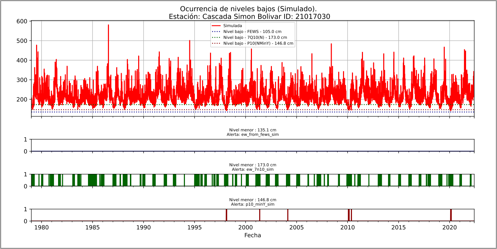

# PYWLwg - IDEAM
## Python Water Level warning generator IDEAM

Fecha:       13-12-2020
Versión:     En desarrollo
Referencias: 
 * [Sanchez Lozano, 2021](https://www.doi.org/10.3390/hydrology8020071)
 * [darly Rojas](https://github.com/DarllyRojas)
 * [IDEAM](http://www.ideam.gov.co)
 * [GEOGloWS Streamflow ECMWF](https://geoglows.ecmwf.int)
 * [Centro Internacional de Agricultura Tropical](https://ciat.cgiar.org/?lang=es)
 * [Servir-Amazonia](https://servir.ciat.cgiar.org/?lang=es)

## Tabla de contenido
1. [Objetivo](#objetivo)
2. [Lista de tareas](#lista-de-tareas)
3. [Instalación](#instalación)
3. [Uso de la herramienta](#uso-de-la-herramienta)
4. [Licencia](#licencia)
5. [Organización del proyecto](#organización-del-proyecto)
6. [Histórico](#histórico)

## Objetivo
A partir de los datos observados de los niveles del agua en los diferentes ríos
de Colombia obetnidas a partir de las estaciones de propiedad del IDEAM y las 
correcciones generadas a los resultados de caudales simulados por el modelo 
GEOGloWS Streamflows ECMWF Service y la metodologia propuesta por [Sanchez Lozano, 2021](https://www.doi.org/10.3390/hydrology8020071),
se presenta la libreria desarrollada para la generación de alertas respecto a la
navegabilidad de los principales cauces del país.

### Lista de tareas
- [ ] Definir nombre. 
- [x] Crear repositorio.
- [x] Automatizar deascarga/lectura de la información secundaria (series de niveles,
	  pronostico de niveles, perfiles de río, etc.).
- [x] Implementar metodologia de (Sanches Lozano, 2021).
- [ ] Análizar resultados obtenidos.
- [ ] Plantear ejemplo de la herramienta.
- [ ] Comentar las funciones desarrolladas.
- [ ] Revisar ortografía y de estilo.
- [ ] Finalizar la herramienta.

## Instalación
-------------
En desarrollo.

## Uso de la herramienta
---------------------
En desarrollo.

## Licencia
--------
En desarrollo.

## Organización del proyecto
-------------------------
    .
    ├── README.md
    ├── LICENSE
    ├── setup.py        <- setup script compatible con pip
    ├── environment.yml <- YML-file para configurar el conda environment
	|── request.txt     <- request-file para configurar el ambiente
	|── old             <- Scripts obsoletos
	|── analysis        <- Scrips para revision de los resultados
    ├── docs            <- Documentación
		├── imgs                   <- Imagenes
        ├── ...                    <- Archivos de la documentación
    ├── examples        <- Jupyter notebooks con ejemplos de la API
        ├── ...                    <- Folder con archivos para ejecutar el ejemplo.
    ├── pyla            <- Libreria/herramienta
        ├── ...                    <- Funciones de la API
	├── static          <- Bases de datos
		├── profiles_db.json       <- Base de datos de secciones transversales del ríos.
		├── IDEAM_Stations_v2.json <- Base de datos de las estaciones usadas.
		├── ...                    <- Otras bases de datos

## Histórico
---------
### Fecha: 19/12/2022

Actualización de las funciones presentadas a continuación:
	- geoson_data 		  : Objetivo - Análisis de archivos geojson.
	- hist_data           : Objetivo - Manejo de información observada.
	- sim_data            : Objetivo - Manejo de información simulada.
	- timeseries_analysis : Objetivo - Análisis de las series de tiempo
Actualización test.py como primer acercamiento al ejemplo de la herramienta.
Actualización __init__.py como archivo main de la herramienta.
Actualización const.py como variables constantes de la herramienta.

Notas:

	Al ejecutar el archivo test.py se obtienen los resultados de la comparación
	entre los datos simulados y los datos observados para una estación 
	determinada, comparando visualmente las cantidades obtenidas, los cambios
	dados en las cantidades, los días consecutivos en que presentó ascenso de los
	niveles y los días consecutivos que presentaron descensos de los niveles. A 
	continuación, se presenta la gráfica asociada a esta comparación visual para
	la estación 44037040.
	

	
	Para la comparación matemática, al ejecutar el archivo test.py, en la 
	terminal se presentan los datos obtenidos de la plataforma FEWS y las 
	matrices de confusión de los datos simulados y observados. Teniendo en 
	cuenta los siguientes casos:
	
	- Comparación entre las alertas generadas por la serie histórica observada y
	el nivel mínimo reportado en FEWS, y las alertas generadas por la serie 
	histórica simulada corregida y el nivel mínimo producido por el periodo de 
	retorno asociado al nivel mínimo reportado en FEWS.
	
	- Comparación entre la serie histórica observada y la serie simulada, siendo
	los valores 1 si el valor en una fecha determinada es mayor al valor del día
	inmediatamente anterior o -1 si el valor en una fecha determinada es 
	menor al valor del día inmediatamente anterior.
	
	- Comparación entre la serie histórica observada y la serie simulada, siendo
	los valores el número de días consecutivos que se presentó un acenso (en el 
	primer caso) o un descenso (en el segundo caso.).
	
	Estos resultados se muestran de manera similar a los presentados en la 
	gráfica a continuación:
	

	
### Fecha: 22/12/2022

Actualización:
Actualizacion bases de datos:
	- Añadida las ubicaciones de las estaciones. IDEAM_Stations_v2.json
	- Añadida las secciones transversales - profiles_db.json
Actualización a las funciones 
	- __init__.py     : Update -> Nuevas funciones añadidas
	- const.py        : Update -> Localizaciones actualizadas
	- geojson_data.py : New    -> Lectura de la tabla de files tipo geojson.
	- profile_data.py : New    -> Lectura de la base de datos de las secciones transversales.
	- test.py         : Update -> Incluye el uso de la lectura de las secciones transversales.

### Fecha: 03/01/2023
Actualización 
	New! :
	- Carpeta View.
	- series_plor.py -> Nuevas funciones para comparación visual de los re
						sultados.
	Update! :
	- __init__.py            -> Nuevas funciones añadidas
	- timeseries_analysis.py -> Nuevas funciones añadidas

Notas:

	Para realizar la comparación visual de los valores mínimos observados y simulados se presentan dos diferentes tipos de se graficas, las graficas tipo scatter y las graficas time series. Las graficas tipo scatter se muestran en la parte izquierda de la imágen a continuación, mostrando en el eje x los valores observados y el eje y los valores simulados. De arriba hacia abajo se observa la comparación de los niveles minimos mensuales, seguido de la comparación de los niveles minimos mensuales multianuales y finalizando con los niveles mínimos anuales. A la derecha se observan las graficas tipo time series, con las mismas comparaciones explicadas previamente.

	Para graficar estos resultados se desarrollo un script que permite una sencilla reproducción de los resultados. El script se localiza en view/serie_plot.py, sin embargo, para su llamado se ultilizaran las siguientes rutinas:

	1. Para la comparacion de los datos mínimos mensuales.
		pyla.scatter_monthly_yearly_comparation()
		pyla.serie_monthly_yearly_comparation()

	2. Para la comparación de los datos minímos mensuales multianuales.
		pyla.scatter_monthly_comparation()
		pyla.serie_monthly_comparation()

	3. Para la comparación de los mínimos anuales.
		pyla.scatter_yearly_comparation()
		pyla.serie_yearly_comparation()

### Fecha: 02/02/2023
#### Actualización:
New! :
	- Cambio a : pyAGIS - Python Analytic for Geoglows and IDEAM station

	- Folder cache -> Folder destinado al almacenamiento temporal de resultados.
	- Folder old -> Folder destinado al almacenamiento de scripts eliminados.
	- Magnitud_Analysis.py -> Analisis de la magnitud de las series de IDEAM y las series simuladas correguidas.
	- Ocurrence_analysis.py -> Analisis de ocurrencia de alertas de las series de IDEAM y las series simuladas correguidas.
	- Tendential_Analysis.py -> Analisis tendencial de las series de IDEAM y las series simuladas correguidas.

	Update! :
	- pyla/pyla/const.py -> Inclusion de la localización del folder cache/forecast.
	- hist_data.py -> En la class Fews_data se incluye la posibilidad de cargar los datos almacenados en la webpage de FEWS, siendo estas, primero, las series de caudales, niveles y precipitación observadas o por sensor y los datos asociados a las estaciones.
	- sim_data.py -> Inclusión de la class Forecast_data que permite la carga de los pronosticos encontrados en el folder cache/forecast.
	- timeseries_analysis.py -> 
		1. En el calculo de periodo de retorno se incluye la posibilidad de seleccionar si se trabaja con probabilidad de ocurrencia o con probabilidad de excedencia (default).
		2. Corrección del loc y el scale usado en la distribución de probabilidad gumbel_r. Y mejorar la facilidad del cambio de estas metricas.
		3. Inclusion de la class Main_values_from_serie para el calculo de los caudales minimos mensuales y los caudales extremos minimos (https://doi.org/10.1111/j.1752-1688.2007.00099.x).
	- serie_plot.py -> Mejora de las graficas a imprimir con get_monthly_minimum_scatter.
	- README.md -> Notas de la actualización.

#### Notas: 

__De Ocurrence_analysis.py__

Este script presenta el analisis de ocurrencia planteado para la revision del comportamiento de los niveles de alerta identificados para la serie de tiempo observada y la serie de tiempo. De manera similar a la presentada en la imagen a continuación.

Para este se utilizan las siguientes metricas para la identificación del comportamiento de los resultados frente a los datos observados: Tasa de verdaderos positivos, la rasa de falsos positivos y el f1-score.

__De Tendential_Analysis.py__

Este script presenta el analisis de tendencias planteados para la revision del comportamiento de las series de nivel minimo anual observado y simulado. Obteniendo los resultados como se presentan en la imagen a continuación.

__De Magnitude_Analysis.py__

Este script presenta el analisis de magnitudes planteados para la revision del comportamiento de las series de nivel minimo anual observado y simulado. Obteniendo los resultados como se presentan en la imagen a continuación.

Como metricas de desempeño se usaron el KGE y el coeficiente $r^2$ de Pearson.

### Fecha: 02/02/2023
#### Actualización:
New! :
- pyAGIS/__init__.py -> Se añade get_flow_rating_curve.
- static/FlowRatingCurve -> Se añaden las curvas de gasto.
- pyAGIS/model/flow_rating_curve.py -> Se añade la función de lectura de las curvas de calibración del caudal.
- pyAGIS/const.py -> Se añade 'FOLDER FLOW RATING CURVE' al diccionario CONST.

