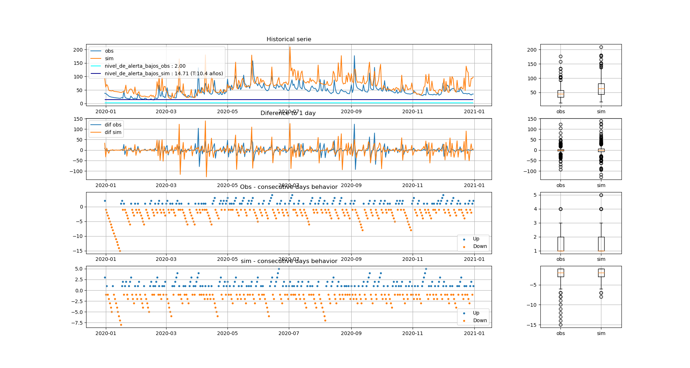
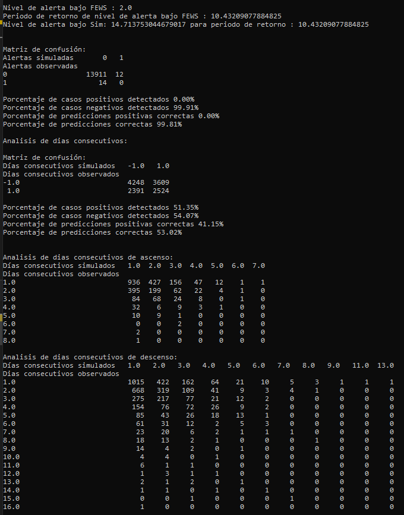

# PYWLwg - IDEAM
## Python Water Level warning generator IDEAM

Fecha:       13-12-2020
Versión:     En desarrollo
Referencias: 
 * [Sanchez Lozano, 2021](https://www.doi.org/10.3390/hydrology8020071)
 * [darly Rojas](https://github.com/DarllyRojas)
 * [IDEAM](http://www.ideam.gov.co)
 * [GEOGloWS Streamflow ECMWF](https://geoglows.ecmwf.int)
 * [Centro Internacional de Agricultura Tropical](https://ciat.cgiar.org/?lang=es)
 * [Servir-Amazonia](https://servir.ciat.cgiar.org/?lang=es)

## Tabla de contenido
1. [Objetivo](#objetivo)
2. [Lista de tareas](#lista-de-tareas)
3. [Instalación](#instalación)
3. [Uso de la herramienta](#uso-de-la-herramienta)
4. [Licencia](#licencia)
5. [Organización del proyecto](#organización-del-proyecto)
6. [Histórico](#histórico)

## Objetivo
A partir de los datos observados de los niveles del agua en los diferentes ríos
de Colombia obetnidas a partir de las estaciones de propiedad del IDEAM y las 
correcciones generadas a los resultados de caudales simulados por el modelo 
GEOGloWS Streamflows ECMWF Service y la metodologia propuesta por [Sanchez Lozano, 2021](https://www.doi.org/10.3390/hydrology8020071),
se presenta la libreria desarrollada para la generación de alertas respecto a la
navegabilidad de los principales cauces del país.

### Lista de tareas
- [ ] Definir nombre. 
- [x] Crear repositorio.
- [x] Automatizar deascarga/lectura de la información secundaria (series de niveles,
	  pronostico de niveles, perfiles de río, etc.).
- [x] Implementar metodologia de (Sanches Lozano, 2021).
- [ ] Análizar resultados obtenidos.
- [ ] Plantear ejemplo de la herramienta.
- [ ] Comentar las funciones desarrolladas.
- [ ] Revisar ortografía y de estilo.
- [ ] Finalizar la herramienta.

## Instalación
-------------
En desarrollo.

## Uso de la herramienta
---------------------
En desarrollo.

## Licencia
--------
En desarrollo.

## Organización del proyecto
-------------------------
    .
    ├── README.md
    ├── LICENSE
    ├── setup.py        <- setup script compatible con pip
    ├── environment.yml <- YML-file para configurar el conda environment
	|── request.txt     <- request-file para configurar el ambiente
    ├── docs            <- Documentación
		├── imgs                   <- Imagenes
        ├── ...                    <- Archivos de la documentación
    ├── examples        <- Jupyter notebooks con ejemplos de la API
        ├── ...                    <- Folder con archivos para ejecutar el ejemplo.
    ├── pyla            <- Libreria/herramienta
        ├── ...                    <- Funciones de la API
	├── static          <- Bases de datos
		├── profiles_db.json       <- Base de datos de secciones transversales del ríos.
		├── IDEAM_Stations_v2.json <- Base de datos de las estaciones usadas.
		├── ...                    <- Otras bases de datos

## Histórico
---------
### Fecha: 19/12/2022

Actualización de las funciones presentadas a continuación:
	- geoson_data 		  : Objetivo - Análisis de archivos geojson.
	- hist_data           : Objetivo - Manejo de información observada.
	- sim_data            : Objetivo - Manejo de información simulada.
	- timeseries_analysis : Objetivo - Análisis de las series de tiempo
Actualización test.py como primer acercamiento al ejemplo de la herramienta.
Actualización __init__.py como archivo main de la herramienta.
Actualización const.py como variables constantes de la herramienta.

Notas:

	Al ejecutar el archivo test.py se obtienen los resultados de la comparación
	entre los datos simulados y los datos observados para una estación 
	determinada, comparando visualmente las cantidades obtenidas, los cambios
	dados en las cantidades, los días consecutivos en que presentó ascenso de los
	niveles y los días consecutivos que presentaron descensos de los niveles. A 
	continuación, se presenta la gráfica asociada a esta comparación visual para
	la estación 44037040.
	

	
	Para la comparación matemática, al ejecutar el archivo test.py, en la 
	terminal se presentan los datos obtenidos de la plataforma FEWS y las 
	matrices de confusión de los datos simulados y observados. Teniendo en 
	cuenta los siguientes casos:
	
	- Comparación entre las alertas generadas por la serie histórica observada y
	el nivel mínimo reportado en FEWS, y las alertas generadas por la serie 
	histórica simulada corregida y el nivel mínimo producido por el periodo de 
	retorno asociado al nivel mínimo reportado en FEWS.
	
	- Comparación entre la serie histórica observada y la serie simulada, siendo
	los valores 1 si el valor en una fecha determinada es mayor al valor del día
	inmediatamente anterior o -1 si el valor en una fecha determinada es 
	menor al valor del día inmediatamente anterior.
	
	- Comparación entre la serie histórica observada y la serie simulada, siendo
	los valores el número de días consecutivos que se presentó un acenso (en el 
	primer caso) o un descenso (en el segundo caso.).
	
	Estos resultados se muestran de manera similar a los presentados en la 
	gráfica a continuación:
	

	
### Fecha: 22/12/2022

Actualización:
Actualizacion bases de datos:
	- Añadida las ubicaciones de las estaciones. IDEAM_Stations_v2.json
	- Añadida las secciones transversales - profiles_db.json
Actualización a las funciones 
	- __init__.py     : Update -> Nuevas funciones añadidas
	- const.py        : Update -> Localizaciones actualizadas
	- geojson_data.py : New    -> Lectura de la tabla de files tipo geojson.
	- profile_data.py : New    -> Lectura de la base de datos de las secciones transversales.
	- test.py         : Update -> Incluye el uso de la lectura de las secciones transversales.